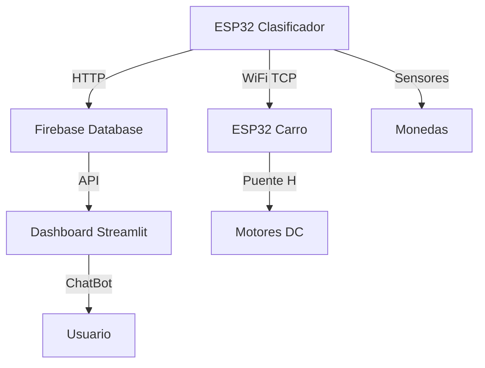

# 🪙🤖 Sistema Clasificador IoT de Monedas Colombianas 

## Descripción del Proyecto

Sistema automático de clasificación de monedas colombianas (50, 200 y 1000 pesos) que utiliza dos ESP32 interconectados: uno para la clasificación mediante sensores de peso e infrarrojos, y otro para controlar un carro robótico que ejecuta movimientos específicos según el tipo de moneda detectada. El sistema incluye un dashboard web en tiempo real con chatbot especializado.

**Video de funcionamiento:** https://youtu.be/mhKJIaTK_bk?feature=shared

**Dashboard en vivo:** https://proyectofinaliot3corte.streamlit.app/

**Base de datos Firebase:** https://clasificador-d7264-default-rtdb.firebaseio.com/IoT

---

## Arquitectura del Sistema



### Componentes Principales

#### ESP32 Clasificador (IP: 10.200.3.107)
- **Función:** Detectar, pesar y clasificar monedas
- **Sensores:** 3x HX711 + celdas de carga, 3x sensores infrarrojos
- **Conectividad:** WiFi + Firebase + TCP Cliente

#### ESP32 Carro (Puerto TCP: 12345)
- **Función:** Ejecutar movimientos según comandos recibidos
- **Hardware:** Puente H + 2 motores DC
- **Conectividad:** WiFi + TCP Servidor

#### Dashboard Web
- **Tecnología:** Streamlit + Plotly + ChatBot con IA
- **Funciones:** Monitoreo en tiempo real, análisis de datos, asistente virtual

---

## 🔌 Configuración de Hardware

### ESP32 Clasificador - Conexiones

#### Sensores HX711 (Peso)
```
HX711 #1 (Monedas 1000 pesos):
├── DOUT: GPIO 17
├── SCK:  GPIO 18
└── Escala: 200

HX711 #2 (Monedas 200 pesos + 50 viejas):
├── DOUT: GPIO 19
├── SCK:  GPIO 21
└── Escala: 200

HX711 #3 (Monedas 50 nuevas):
├── DOUT: GPIO 22
├── SCK:  GPIO 23
└── Escala: 280
```

#### Sensores Infrarrojos
```
Sensor IR monedas 1000: GPIO 16
Sensor IR monedas 200:  GPIO 4
Sensor IR monedas 50:   GPIO 15
```

### ESP32 Carro - Conexiones

#### Puente H y Motores
```
Motor A (Izquierdo):
├── IN1: GPIO 14
└── IN2: GPIO 27

Motor B (Derecho):
├── IN3: GPIO 26
└── IN4: GPIO 25
```

---

## Especificaciones de Monedas Colombianas

| Denominación | Diámetro | Espesor | Peso Teórico | Tipo |
|--------------|----------|---------|--------------|------|
| 50 pesos nueva | 17 mm | 1.17 mm | 2.0 g | Nueva |
| 50 pesos vieja | 21 mm | 1.3 mm | 4.0 g | Vieja |
| 200 pesos nueva | 22.4 mm | 2.1 mm | 4.61 g | Nueva |
| 200 pesos vieja | 24.4 mm | 1.7 mm | 7.1 g | Vieja |
| 1000 pesos | 26.7 mm | 2.2 mm | 9.95 g | Nueva |

---

## Algoritmo de Clasificación

### Proceso Paso a Paso

1. **Detección:** Sensor infrarrojo detecta inserción de moneda
2. **Estabilización:** Sistema espera 1 segundo (`utime.sleep(1)`)
3. **Pesaje:** Sensor HX711 toma 3 lecturas (`get_units(times=3)`)
4. **Cálculo:** Peso promedio dinámico = `peso_total/cantidad_monedas`
5. **Clasificación:** Aplicación de rangos predefinidos
6. **Actualización:** Incremento de contadores específicos
7. **Comunicación:** Envío de datos a Firebase
8. **Control Robótico:** Cada 3 monedas envía comando TCP al carro

### Rangos de Clasificación

```python
# Monedas de 1000 pesos (solo nuevas)
if 3.0 <= peso_promedio <= 20.0:
    contador_1000 += 1

# Monedas de 200 pesos
if 4.7 <= peso_promedio <= 12.0:
    if peso_promedio < 6.0:
        contador_200_nueva += 1  # Nueva
    else:
        contador_200_vieja += 1  # Vieja

# Monedas de 50 pesos nuevas (sensor 3)
if 0 <= peso_promedio <= 16.0:
    contador_50_nueva += 1

# Monedas de 50 pesos viejas (sensor 2)
if 2.0 <= peso_promedio <= 4.3:
    contador_50_vieja += 1
```

---

## Control del Carro 

### Comandos TCP

El ESP32 clasificador envía comandos TCP cada 3 monedas clasificadas:

| Comando | Denominación | Función |
|---------|--------------|---------|
| `'a'` | 3x monedas 1000 | `recorrido1()` |
| `'s'` | 3x monedas 200 | `recorrido2()` |
| `'d'` | 3x monedas 50 | `recorrido3()` |

### Movimientos Programados

#### Recorrido 1 (Comando 'a' - Monedas 1000)
```cpp
void recorrido1() {
  avanzar(2000);                              // Avanzar 2 segundos
  detener(1000);                              // Parar 1 segundo
  motorA(false, false); motorB(true, false);  // Solo motor B avanza 1 seg
  delay(1000);
  detener(1000);                              // Parar 1 segundo
  motorA(true, false); motorB(false, false);  // Solo motor A avanza 1 seg
  delay(1000);
  detener(1000);                              // Parar 1 segundo
  avanzar(2000);                              // Avanzar 2 segundos
  detener(5000);                              // Parar 5 segundos
}
```

#### Recorrido 2 (Comando 's' - Monedas 200)
```cpp
void recorrido2() {
  unsigned long startTime = millis();
  while (millis() - startTime < 7000) {       // Avanzar 7 segundos
    motorA(true, false);
    motorB(true, false);
  }
  detener(1000);                              // Parar 1 segundo
  motorA(true, false); motorB(false, false);  // Solo motor A avanza 1 seg
  delay(1000);
  detener(1000);                              // Parar 1 segundo
  avanzar(2000);                              // Avanzar 2 segundos
  detener(5000);                              // Parar 5 segundos
}
```

#### Recorrido 3 (Comando 'd' - Monedas 50)
```cpp
void recorrido3() {
  motorA(false, true); motorB(true, false);   // A retrocede, B avanza 1.5 seg
  delay(1500);
  detener(1000);                              // Parar 1 segundo
  avanzar(2000);                              // Avanzar 2 segundos
  detener(1000);                              // Parar 1 segundo
  motorA(true, false); motorB(false, true);   // A avanza, B retrocede 1.5 seg
  delay(1500);
  detener(1000);                              // Parar 1 segundo
}
```

---

## Configuración de Red

### WiFi
```python
# Configuración común para ambos ESP32
ssid = "WUSTA"
password = "USTA8600"
```

### Firebase Database
```
URL: https://clasificador-d7264-default-rtdb.firebaseio.com/IoT.json
Método: HTTP PATCH
Datos JSON: {
  "ConteoGlobal": total_monedas,
  "Monedas1000": contador_1000,
  "Monedas200": contador_200,
  "Monedas50": contador_50,
  "Error": contador_error,
  "PesoCaja1": peso_total_1000,
  "PesoCaja2": peso_total_200,
  "PesoCaja3": peso_total_50,
  "Monedas1000Nuevas": contador_1000_nueva,
  "Monedas200Nuevas": contador_200_nueva,
  "Monedas200Viejas": contador_200_vieja,
  "Monedas50Nuevas": contador_50_nueva,
  "Monedas50Viejas": contador_50_vieja
}
```

### 🔌 Comunicación TCP
```python
# ESP32 Clasificador (Cliente TCP)
SERVER_IP = "10.200.3.107"
SERVER_PORT = 12345

def enviar_comando(comando: str):
    addr = socket.getaddrinfo(SERVER_IP, SERVER_PORT)[0][-1]
    s = socket.socket()
    s.connect(addr)
    s.send(comando.encode())
    s.close()
```

```cpp
// ESP32 Carro (Servidor TCP)
WiFiServer server(12345);

void loop() {
  WiFiClient client = server.available();
  if (client && client.available()) {
    char comando = client.read();
    ejecutarRecorrido(comando);
  }
}
```

---

## 💻 Instalación del Software

### 🔧 ESP32 Clasificador (MicroPython)

#### Paso 1: Instalar MicroPython
1. Instalar Thonny IDE
2. Conectar ESP32 via USB
3. En Thonny: `Herramientas > Opciones > Intérprete > MicroPython (ESP32)`
4. `Herramientas > Opciones > Intérprete > Instalar firmware`
5. Presionar botón BOOT durante flasheo

#### Paso 2: Estructura de Archivos
```
ESP32_Clasificador/
├── lib/
│   └── hx711.py          # Biblioteca para sensores HX711
└── ClasificadorMonedas.py # Programa principal
```

#### Paso 3: Bibliotecas Requeridas
```python
# Bibliotecas incluidas en MicroPython
from hx711 import HX711
from machine import Pin
import utime
import urequests
import json
import network
import socket
```

###  ESP32 Carro (Arduino IDE)

#### Paso 1: Configurar Arduino IDE
1. Instalar Arduino IDE
2. Agregar soporte ESP32: `Archivo > Preferencias > URLs Gestor`
3. URL: `https://raw.githubusercontent.com/espressif/arduino-esp32/gh-pages/package_esp32_index.json`
4. `Herramientas > Placa > Gestor de Tarjetas > ESP32`

#### Paso 2: Bibliotecas Requeridas
```cpp
#include <WiFi.h>  // Biblioteca WiFi para ESP32
```

### Dashboard Streamlit

#### Paso 1: Instalar Dependencias
```bash
pip install streamlit
pip install plotly
pip install pandas
pip install requests
pip install gtts
pip install streamlit-mic-recorder
```

#### Paso 2: Ejecutar Dashboard
```bash
streamlit run dashboard_clasificador.py
```

---

## Funcionalidades del Dashboard

### Métricas en Tiempo Real
- **Contador Total:** Monedas clasificadas exitosamente
- **Valor Acumulado:** Suma en pesos colombianos (COP)
- **Peso Total:** Suma de todas las cajas en gramos
- **Errores:** Monedas rechazadas por fuera de rango

### Visualizaciones
- **Gráfico de Barras:** Cantidad por denominación
- **Velocímetro:** Peso total del sistema
- **Gráfico Combinado:** Relación peso vs cantidad
- **Distribución:** Monedas nuevas vs viejas
- **Tabla Detallada:** Desglose completo por tipo

### ChatBot Especializado
- **Reconocimiento de Voz:** Habla directamente con el asistente
- **Respuestas Técnicas:** Información específica del proyecto
- **Audio Automático:** Reproduce respuestas en español
- **Consultas Predefinidas:** Botones para preguntas frecuentes

---

## Instrucciones de Uso

### Inicio del Sistema

1. **Encender ESP32 Carro:**
   ```
   - Conectar alimentación
   - Verificar conexión WiFi en monitor serial
   - Confirmar mensaje: "Servidor TCP iniciado"
   ```

2. **Encender ESP32 Clasificador:**
   ```
   - Asegurar celdas de carga sin peso
   - Ejecutar ClasificadorMonedas.py en Thonny
   - Esperar mensaje: "Sistema listo. Inserta monedas."
   ```

3. **Abrir Dashboard:**
   ```
   - Acceder: https://proyectofinaliot3corte.streamlit.app/
   - Verificar conexión Firebase (indicador verde)
   ```

### Operación

1. **Insertar Monedas:**
   - Una moneda a la vez
   - Esperar estabilización (1 segundo)
   - Observar clasificación en consola y dashboard

2. **Control Automático del Carro:**
   - Cada 3 monedas de 1000 → Comando 'a' → Recorrido 1
   - Cada 3 monedas de 200 → Comando 's' → Recorrido 2
   - Cada 3 monedas de 50 → Comando 'd' → Recorrido 3

3. **Monitoreo en Dashboard:**
   - Actualización automática cada 30 segundos
   - Gráficos en tiempo real
   - Chatbot para consultas técnicas

### Finalización

1. **Detener Clasificador:** `Ctrl+C` en Thonny
2. **Ver Resumen Final:** Conteo completo y valores
3. **Datos Guardados:** Automáticamente en Firebase

---

## Calibración

### Calibración de Sensores HX711

```python
# Valores de escala por sensor
hx_1.set_scale(200)  # Sensor 1 (monedas 1000)
hx_2.set_scale(200)  # Sensor 2 (monedas 200 + 50 viejas)
hx_3.set_scale(280)  # Sensor 3 (monedas 50 nuevas)

# Tara inicial (sin peso)
hx_1.tare()
hx_2.tare()
hx_3.tare()
```

### Ajuste de Rangos

```python
# Modificar rangos según calibración específica
PESO_LIMITE_200 = 6.0   # Separación nuevas/viejas 200 pesos
PESO_LIMITE_50 = 3.5    # Separación nuevas/viejas 50 pesos
PESO_DEFECTO_50_NUEVA = 2.0  # Peso por defecto si sensor lee 0
```

### Solución de Problemas

| Problema | Causa Posible | Solución |
|----------|---------------|----------|
| Sensor lee 0 | Celda desconectada | Verificar conexiones GPIO |
| Clasificación errónea | Calibración incorrecta | Ajustar escalas HX711 |
| Carro no responde | TCP desconectado | Reiniciar ambos ESP32 |
| Dashboard sin datos | WiFi/Firebase | Verificar conectividad |

---

##  Estructura de Datos Firebase

```json
{
  "ConteoGlobal": 15,
  "Error": 2,
  "Monedas1000": 8,
  "Monedas200": 4,
  "Monedas50": 3,
  "Monedas1000Nuevas": 8,
  "Monedas1000Viejas": 0,
  "Monedas200Nuevas": 2,
  "Monedas200Viejas": 2,
  "Monedas50Nuevas": 1,
  "Monedas50Viejas": 2,
  "PesoCaja1": 79.6,
  "PesoCaja2": 25.22,
  "PesoCaja3": 2.0
}
```

---

##  Características Técnicas Avanzadas

###  Inteligencia del Sistema
- **Clasificación Automática:** Distingue automáticamente monedas nuevas vs viejas
- **Peso Promedio Dinámico:** Mejora precisión con cada moneda procesada
- **Tolerancia a Errores:** Manejo de lecturas fuera de rango
- **Peso por Defecto:** Valor 2.0g para monedas 50 nuevas cuando sensor lee 0

###  Comunicación IoT
- **Protocolo TCP:** Comunicación confiable entre ESP32
- **HTTP Requests:** Actualización en tiempo real a Firebase
- **Socket Programming:** Cliente/servidor para control robótico
- **JSON Data:** Estructura estándar para intercambio de datos

### Dashboard Interactivo
- **Plotly Graphics:** Visualizaciones dinámicas y responsivas
- **Real-time Updates:** TTL de 30 segundos para datos frescos
- **Voice Recognition:** Reconocimiento de voz en español
- **AI ChatBot:** Asistente especializado con conocimiento técnico

---

## Equipo de Desarrollo

**Estudiantes de Ingeniería Electrónica**
- Desarrollo de hardware y firmware ESP32
- Implementación de algoritmos de clasificación
- Diseño de dashboard web interactivo
- Integración de sistemas IoT

---

## Códigos Completos del Proyecto

### Código 1: ESP32 Clasificador (MicroPython - Thonny)

Este código se ejecuta en el ESP32 principal que clasifica las monedas usando sensores de peso e infrarrojos.

```python
from hx711 import HX711
from machine import Pin
import utime
import urequests
import json
import network
import socket

# ===== CONFIGURACIÓN DE RED Y SERVIDOR =====
SERVER_IP = "10.200.3.107"   # IP del ESP32 del carro
SERVER_PORT = 12345          # Puerto TCP para comunicación
CANTIDAD_LIMITE = 3          # Envía comando cada 3 monedas

ssid     = "WUSTA"
password = "USTA8600"

# Conexión WiFi
wifi = network.WLAN(network.STA_IF)
if not wifi.isconnected():
    print("Conectando a Wi-Fi...")
    wifi.active(True)
    wifi.connect(ssid, password)
    while not wifi.isconnected():
        utime.sleep(0.5)
print("Wi-Fi conectado, IP:", wifi.ifconfig()[0])

FIREBASE_URL = "https://clasificador-d7264-default-rtdb.firebaseio.com/IoT.json"

# ===== FUNCIONES DE COMUNICACIÓN =====
def actualizar_firebase(datos: dict):
    """Envía datos a Firebase mediante HTTP PATCH"""
    try:
        respuesta = urequests.patch(FIREBASE_URL, data=json.dumps(datos))
        print("HTTP status:", respuesta.status_code)
        print("Respuesta Firebase:", respuesta.text)
        respuesta.close()
    except Exception as e:
        print("Error al enviar datos a Firebase:", e)

def enviar_comando(comando: str, tipo_moneda: str):
    """Envía comando TCP al carro robótico"""
    try:
        addr = socket.getaddrinfo(SERVER_IP, SERVER_PORT)[0][-1]
        s = socket.socket()
        s.connect(addr)
        s.send(comando.encode())
        s.close()
        print(">> Comando '{}' enviado al servidor para {} monedas".format(comando, tipo_moneda))
    except Exception as e:
        print("Error al enviar comando al servidor:", e)

def verificar_y_enviar_comando(contador, tipo_moneda, comando):
    """Verifica si se alcanzó el límite de 3 monedas y envía comando"""
    if contador > 0 and contador % CANTIDAD_LIMITE == 0:
        enviar_comando(comando, tipo_moneda)
        print("*** {} monedas de {} alcanzadas - Comando '{}' enviado ***".format(
            CANTIDAD_LIMITE, tipo_moneda, comando))
        return True
    return False

# ===== CONFIGURACIÓN DE SENSORES HX711 =====
hx_1 = HX711(dout=17, pd_sck=18)  # Celda de carga 1 (moneda $1000)
hx_2 = HX711(dout=19, pd_sck=21)  # Celda de carga 2 (moneda $200 / $50 viejas)
hx_3 = HX711(dout=22, pd_sck=23)  # Celda de carga 3 (monedas $50 nuevas)

print("Realizando tara, asegúrate de que la celda esté sin carga...")
hx_1.tare()
hx_2.tare()
hx_3.tare()
print("Tara completada.")

# Ajuste de escala tras calibrar
hx_1.set_scale(200)
hx_2.set_scale(200)
hx_3.set_scale(280)

# ===== CONFIGURACIÓN DE SENSORES INFRARROJOS =====
sensor_1000 = Pin(16, Pin.IN)  # GPIO16 → detección de moneda $1000
sensor_200  = Pin(4, Pin.IN)   # GPIO4  → detección de moneda $200 o $50 viejas
sensor_50   = Pin(15, Pin.IN)  # GPIO15 → detección de moneda $50 nuevas

# ===== VARIABLES DE CONTEO Y CLASIFICACIÓN =====
# Moneda $1000
contador_1000     = 0
peso_total_1000   = 0.0
moneda_1          = 0
peso_promedio_1000= 0.0

# Moneda $200
contador_200           = 0
contador_200_nueva     = 0
contador_200_vieja     = 0
peso_total_200_nueva   = 0.0
peso_total_200_vieja   = 0.0
moneda_2               = 0
peso_promedio_200      = 0.0

# Moneda $50
contador_50           = 0
contador_50_nueva     = 0
contador_50_vieja     = 0
peso_total_50_nueva   = 0.0
peso_total_50_vieja   = 0.0
moneda_3              = 0
peso_promedio_50      = 0.0

# ===== PARÁMETROS DE CLASIFICACIÓN =====
PESO_LIMITE_200 = 6.0        # Separación nuevas/viejas para $200
PESO_LIMITE_50  = 3.5        # Separación nuevas/viejas para $50
PESO_DEFECTO_50_NUEVA = 2.0  # Peso por defecto para $50 nuevas
contador_error = 0

# ===== FUNCIONES DE LECTURA DE SENSORES =====
def leer_peso_1000():
    try:
        return hx_1.get_units(times=3)
    except Exception as e:
        print("Error al leer sensor 1000:", e)
        return 0.0

def leer_peso_200():
    try:
        return hx_2.get_units(times=3)
    except Exception as e:
        print("Error al leer sensor 200:", e)
        return 0.0

def leer_peso_50():
    try:
        peso = hx_3.get_units(times=3)
        if abs(peso) < 0.1:  # Si peso es casi 0
            print("Peso detectado como 0, usando peso por defecto: {:.2f}g".format(
                PESO_DEFECTO_50_NUEVA))
            return PESO_DEFECTO_50_NUEVA
        return peso
    except Exception as e:
        print("Error al leer sensor 50:", e)
        return PESO_DEFECTO_50_NUEVA

# ===== BUCLE PRINCIPAL =====
print("\nSistema listo. Inserta monedas.\n")
print("INFORMACIÓN IMPORTANTE:")
print("- Monedas de 1000")
print("- Monedas de 200")
print("- Monedas de 50")
print("*** COMANDO SE ENVÍA CADA {} MONEDAS ***".format(CANTIDAD_LIMITE))
print("-"*50)

try:
    while True:
        # ─── Detectar moneda $1000 ─────────────────────────────────────────
        if sensor_1000.value() == 0:
            print("\n--- Sensor de moneda 1000 activado ---")
            moneda_1 += 1
            utime.sleep(1)  # Espera estabilización
            peso = leer_peso_1000()
            peso_promedio_1000 = peso / moneda_1
            print("Peso promedio $1000 por moneda: {:.2f} g".format(peso_promedio_1000))

            # Validar rango (solo nuevas)
            if 3.0 <= peso_promedio_1000 <= 20.0:
                contador_1000 += 1
                peso_total_1000 += peso_promedio_1000
                print("✓ Moneda de $1000 NUEVA registrada. Total $1000: {}".format(contador_1000))
                
                # Enviar comando cada 3 monedas
                verificar_y_enviar_comando(contador_1000, "$1000", 'a')
            else:
                moneda_1 -= 1
                contador_error += 1
                print("✗ Moneda $1000 rechazada (fuera de rango).")

            # Actualizar Firebase
            datos_fb = {
                "ConteoGlobal": contador_1000 + contador_200 + contador_50,
                "Error": contador_error,
                "Monedas1000": contador_1000,
                "Monedas200": contador_200,
                "Monedas50": contador_50,
                "Monedas1000Nuevas": contador_1000,
                "Monedas1000Viejas": 0,
                "Monedas200Nuevas": contador_200_nueva,
                "Monedas200Viejas": contador_200_vieja,
                "Monedas50Nuevas": contador_50_nueva,
                "Monedas50Viejas": contador_50_vieja,
                "PesoCaja1": peso_total_1000,
                "PesoCaja2": peso_total_200_nueva + peso_total_200_vieja,
                "PesoCaja3": peso_total_50_nueva + peso_total_50_vieja
            }
            actualizar_firebase(datos_fb)

        # ─── Detectar moneda $200 o $50 vieja ────────────────────────────
        if sensor_200.value() == 0:
            print("\n--- Sensor de moneda 200 activado ---")
            moneda_2 += 1
            utime.sleep(1)
            peso = leer_peso_200()
            peso_promedio_200 = peso / moneda_2
            print("Peso promedio sensor 200: {:.2f} g".format(peso_promedio_200))

            # Moneda de $200
            if 4.7 <= peso_promedio_200 <= 12:
                contador_200 += 1
                
                # Distinguir nueva vs vieja
                if peso_promedio_200 < PESO_LIMITE_200:
                    contador_200_nueva += 1
                    peso_total_200_nueva += peso_promedio_200
                    print("✓ Moneda de $200 NUEVA registrada. Total $200: {}".format(contador_200))
                else:
                    contador_200_vieja += 1
                    peso_total_200_vieja += peso_promedio_200
                    print("✓ Moneda de $200 VIEJA registrada. Total $200: {}".format(contador_200))

                print("  $200 Nuevas: {} | $200 Viejas: {}".format(
                    contador_200_nueva, contador_200_vieja))
                
                verificar_y_enviar_comando(contador_200, "$200", 's')

            # Moneda de $50 vieja
            elif 2.0 <= peso_promedio_200 <= 4.3:
                contador_50 += 1
                contador_50_vieja += 1
                peso_total_50_vieja += peso_promedio_200
                print("✓ Moneda de $50 VIEJA registrada (sensor 200). Total $50: {}".format(contador_50))
                print("  $50 Nuevas: {} | $50 Viejas: {}".format(
                    contador_50_nueva, contador_50_vieja))
                
                verificar_y_enviar_comando(contador_50, "$50", 'd')
            else:
                moneda_2 -= 1
                contador_error += 1
                print("✗ Moneda rechazada en sensor 200 (fuera de rango).")

            # Actualizar Firebase
            actualizar_firebase(datos_fb)

        # ─── Detectar moneda $50 nueva ────────────────────────────────────
        if sensor_50.value() == 0:
            print("\n--- Sensor de moneda 50 activado ---")
            moneda_3 += 1
            utime.sleep(1)
            peso = leer_peso_50()
            peso_promedio_50 = peso / moneda_3
            print("Peso promedio sensor 50: {:.2f} g".format(peso_promedio_50))

            # Solo $50 nuevas en este sensor
            if 0 <= peso_promedio_50 <= 16.0:
                contador_50 += 1
                contador_50_nueva += 1
                peso_total_50_nueva += peso_promedio_50
                print("✓ Moneda de $50 NUEVA registrada. Total $50: {}".format(contador_50))
                print("  $50 Nuevas: {} | $50 Viejas: {}".format(
                    contador_50_nueva, contador_50_vieja))
                
                verificar_y_enviar_comando(contador_50, "$50", 'd')
            else:
                moneda_3 -= 1
                contador_error += 1
                print("✗ Moneda de $50 rechazada (fuera de rango).")

            actualizar_firebase(datos_fb)

        utime.sleep(0.005)  # Lectura cada 5ms

except KeyboardInterrupt:
    # Resumen final al presionar Ctrl+C
    print("\n" + "="*70)
    print("RESUMEN FINAL DEL CONTEO")
    print("="*70)
    
    print("\nTOTAL DE MONEDAS:")
    print("Monedas de $1000: {}".format(contador_1000))
    print("Monedas de $200: {}".format(contador_200))
    print("Monedas de $50: {}".format(contador_50))
    
    print("\nCOMANDOS ENVIADOS:")
    print("Comando 'a' (monedas $1000): {} veces".format(contador_1000 // CANTIDAD_LIMITE))
    print("Comando 's' (monedas $200): {} veces".format(contador_200 // CANTIDAD_LIMITE))
    print("Comando 'd' (monedas $50): {} veces".format(contador_50 // CANTIDAD_LIMITE))
    
    valor_total = contador_1000*1000 + contador_200*200 + contador_50*50
    print("\nTOTAL GENERAL: ${}".format(valor_total))
    
    # Envío final a Firebase
    actualizar_firebase(datos_fb)
    print("Datos finales enviados a Firebase.")
```

#### Explicación del Código del Clasificador:

**1. Importaciones y Configuración:**
- `hx711`: Biblioteca para leer los sensores de peso
- `machine.Pin`: Control de pines GPIO del ESP32
- `urequests`: Para enviar datos HTTP a Firebase
- `socket`: Comunicación TCP con el carro

**2. Conexión de Red:**
- Se conecta a la red WiFi "WUSTA"
- Obtiene IP automáticamente via DHCP
- Configura cliente TCP para comunicarse con el carro en IP 10.200.3.107:12345

**3. Configuración de Sensores:**
- **3 sensores HX711** para pesar monedas:
  - Sensor 1 (GPIO 17,18): Monedas de $1000
  - Sensor 2 (GPIO 19,21): Monedas de $200 y $50 viejas
  - Sensor 3 (GPIO 22,23): Monedas de $50 nuevas
- **3 sensores infrarrojos** para detectar inserción:
  - GPIO 16: Detección $1000
  - GPIO 4: Detección $200/$50 vieja
  - GPIO 15: Detección $50 nueva

**4. Algoritmo de Clasificación:**
- Detecta moneda con sensor infrarrojo
- Espera 1 segundo para estabilización
- Toma 3 lecturas de peso y promedia
- Clasifica según rangos de peso:
  - $1000: 3.0g - 20.0g
  - $200: 4.7g - 12.0g (nueva <6g, vieja >6g)
  - $50 nueva: 0g - 16.0g
  - $50 vieja: 2.0g - 4.3g

**5. Comunicación:**
- Actualiza Firebase después de cada moneda
- Envía comando TCP al carro cada 3 monedas:
  - 'a': 3 monedas de $1000
  - 's': 3 monedas de $200
  - 'd': 3 monedas de $50

---

### Código 2: ESP32 Carro Robótico (Arduino IDE)

Este código controla el carro robótico que ejecuta movimientos según los comandos recibidos del clasificador.

```cpp
#include <WiFi.h>

// ===== CONFIGURACIÓN DE PINES PARA MOTORES =====
#define IN1 14  // Motor A - Control 1
#define IN2 27  // Motor A - Control 2
#define IN3 26  // Motor B - Control 1
#define IN4 25  // Motor B - Control 2

// ===== CONFIGURACIÓN DE RED =====
const char* ssid = "WUSTA";
const char* password = "USTA8600";
WiFiServer server(12345); // Servidor TCP en puerto 12345

void setup() {
  Serial.begin(115200);
  
  // Configurar pines de motores como salida
  pinMode(IN1, OUTPUT);
  pinMode(IN2, OUTPUT);
  pinMode(IN3, OUTPUT);
  pinMode(IN4, OUTPUT);
  
  // Conectar a WiFi
  Serial.println("Conectando a Wi-Fi...");
  WiFi.begin(ssid, password);
  while (WiFi.status() != WL_CONNECTED) {
    delay(500);
    Serial.print(".");
  }
  
  Serial.println();
  Serial.print("Wi-Fi conectado. IP: ");
  Serial.println(WiFi.localIP());
  
  // Iniciar servidor TCP
  server.begin();
  Serial.println("Servidor TCP iniciado, esperando cliente...");
  Serial.println("Presiona 'a', 's' o 'd' para iniciar un recorrido:");
}

void loop() {
  // Verificar si hay cliente TCP conectado
  WiFiClient client = server.available();
  
  if (client) {
    Serial.println("Cliente conectado");
    
    while (client.connected()) {
      // Leer comandos del cliente TCP
      if (client.available()) {
        char comando = client.read();
        Serial.print("Comando recibido (Wi-Fi): ");
        Serial.println(comando);
        ejecutarRecorrido(comando);
      }
      
      // También permite control por monitor serial
      if (Serial.available()) {
        char comandoSerial = Serial.read();
        Serial.print("Comando recibido (Serial): ");
        Serial.println(comandoSerial);
        ejecutarRecorrido(comandoSerial);
      }
      
      delay(10);
    }
    
    client.stop();
    Serial.println("Cliente desconectado");
  }
  
  // Control por serial cuando no hay cliente
  if (Serial.available()) {
    char comandoSerial = Serial.read();
    Serial.print("Comando recibido (Serial): ");
    Serial.println(comandoSerial);
    ejecutarRecorrido(comandoSerial);
  }
}

// ===== FUNCIÓN PRINCIPAL DE EJECUCIÓN =====
void ejecutarRecorrido(char comando) {
  if (comando == 'a') {
    Serial.println("Ejecutando Recorrido 1 - Monedas $1000");
    recorrido1();
  } else if (comando == 's') {
    Serial.println("Ejecutando Recorrido 2 - Monedas $200");
    recorrido2();
  } else if (comando == 'd') {
    Serial.println("Ejecutando Recorrido 3 - Monedas $50");
    recorrido3();
  }
}

// ===== RECORRIDOS PROGRAMADOS =====

// Recorrido 1: Para 3 monedas de $1000
void recorrido1() {
  avanzar(2000);                              // Avanzar 2 segundos
  detener(1000);                              // Parar 1 segundo
  motorA(false, false); motorB(true, false);  // Solo motor B avanza
  delay(1000);
  detener(1000);                              // Parar 1 segundo
  motorA(true, false); motorB(false, false);  // Solo motor A avanza
  delay(1000);
  detener(1000);                              // Parar 1 segundo
  avanzar(2000);                              // Avanzar 2 segundos
  detener(5000);                              // Parar 5 segundos
}

// Recorrido 2: Para 3 monedas de $200
void recorrido2() {
  // Avanzar 7 segundos con control preciso
  unsigned long startTime = millis();
  while (millis() - startTime < 7000) {
    motorA(true, false);
    motorB(true, false);
  }
  detener(1000);                              // Parar 1 segundo
  motorA(true, false); motorB(false, false);  // Solo motor A avanza
  delay(1000);
  detener(1000);                              // Parar 1 segundo
  avanzar(2000);                              // Avanzar 2 segundos
  detener(5000);                              // Parar 5 segundos
}

// Recorrido 3: Para 3 monedas de $50
void recorrido3() {
  motorA(false, true); motorB(true, false);   // Giro: A retrocede, B avanza
  delay(1500);
  detener(1000);                              // Parar 1 segundo
  avanzar(2000);                              // Avanzar 2 segundos
  detener(1000);                              // Parar 1 segundo
  motorA(true, false); motorB(false, true);   // Giro inverso
  delay(1500);
  detener(1000);                              // Parar 1 segundo
}

// ===== FUNCIONES DE CONTROL DE MOTORES =====

void avanzar(int tiempo) {
  motorA(true, false);  // Motor A adelante
  motorB(true, false);  // Motor B adelante
  delay(tiempo);
}

void detener(int tiempo) {
  motorA(false, false); // Motor A detenido
  motorB(false, false); // Motor B detenido
  delay(tiempo);
}

// Control individual del Motor A (izquierdo)
void motorA(bool adelante, bool atras) {
  digitalWrite(IN1, adelante);
  digitalWrite(IN2, atras);
}

// Control individual del Motor B (derecho)
void motorB(bool adelante, bool atras) {
  digitalWrite(IN3, adelante);
  digitalWrite(IN4, atras);
}
```

#### Explicación del Código del Carro:

**1. Configuración de Hardware:**
- Usa un **puente H** para controlar 2 motores DC
- Motor A (izquierdo): Pines GPIO 14 y 27
- Motor B (derecho): Pines GPIO 26 y 25

**2. Servidor TCP:**
- Escucha en puerto 12345
- Acepta conexiones del ESP32 clasificador
- También permite control manual por monitor serial

**3. Recorridos Programados:**
- **Recorrido 1 (comando 'a')**: Patrón complejo con movimientos individuales
- **Recorrido 2 (comando 's')**: Avance largo de 7 segundos + giro
- **Recorrido 3 (comando 'd')**: Giros en ambas direcciones

**4. Control de Motores:**
- `motorA()` y `motorB()`: Control individual de cada motor
- `avanzar()`: Ambos motores hacia adelante
- `detener()`: Ambos motores parados
- Los tiempos están en milisegundos

---

### Código 3: Dashboard Streamlit (Python)

El dashboard proporciona visualización en tiempo real y un chatbot especializado.

```python
import streamlit as st
import pandas as pd
import plotly.express as px
import plotly.graph_objects as go
from plotly.subplots import make_subplots
import requests
import json
from datetime import datetime
import numpy as np
from gtts import gTTS
import os
import base64
from streamlit_mic_recorder import speech_to_text

# ===== CONFIGURACIÓN INICIAL =====
st.set_page_config(
    page_title="Clasificador de Monedas + ChatBot IoT",
    page_icon="🪙",
    layout="wide"
)

# Paleta de colores moderna
COLORS = {
    'primary': '#6366F1',    # Indigo vibrante
    'secondary': '#EC4899',  # Rosa intenso
    'tertiary': '#10B981',   # Verde esmeralda
    'accent': '#F59E0B',     # Ámbar
    'dark': '#1F2937',       # Gris oscuro
    'light': '#F3F4F6',      # Gris claro
}

# URLs y configuración
FIREBASE_URL = "https://clasificador-d7264-default-rtdb.firebaseio.com/IoT.json"
API_KEY = 'sk-53751d5c6f344a5dbc0571de9f51313e'
API_URL = 'https://api.deepseek.com/v1/chat/completions'

# ===== FUNCIÓN PARA OBTENER DATOS DE FIREBASE =====
@st.cache_data(ttl=30)  # Cache de 30 segundos
def obtener_datos_firebase():
    try:
        response = requests.get(FIREBASE_URL, timeout=10)
        return response.json() if response.status_code == 200 else {}
    except:
        return {}

# ===== FUNCIÓN DEL CHATBOT ESPECIALIZADO =====
def obtener_respuesta_especializada(mensaje, datos_sistema):
    """Chatbot con conocimiento específico del proyecto"""
    
    valor_total = (datos_sistema.get('Monedas1000', 0) * 1000 + 
                   datos_sistema.get('Monedas200', 0) * 200 + 
                   datos_sistema.get('Monedas50', 0) * 50)
    
    # Contexto detallado del proyecto para la IA
    contexto_proyecto = f"""
    Eres el asistente del Sistema Clasificador IoT de Monedas Colombianas.
    
    DATOS EN TIEMPO REAL:
    - Total clasificadas: {datos_sistema.get('ConteoGlobal', 0)}
    - Monedas $1000: {datos_sistema.get('Monedas1000', 0)}
    - Monedas $200: {datos_sistema.get('Monedas200', 0)}
    - Monedas $50: {datos_sistema.get('Monedas50', 0)}
    - Valor total: {valor_total:,} COP
    - Errores: {datos_sistema.get('Error', 0)}
    
    ARQUITECTURA:
    - ESP32 clasificador con sensores HX711 e infrarrojos
    - ESP32 carro con puente H y motores DC
    - Comunicación TCP entre ESP32s
    - Firebase para almacenamiento
    - Dashboard Streamlit con IA
    
    Responde técnicamente sin asteriscos. Máximo 100 palabras.
    """
    
    # Llamada a la API de IA
    headers = {
        'Authorization': f'Bearer {API_KEY}',
        'Content-Type': 'application/json'
    }
    
    data = {
        'model': 'deepseek-chat',
        'messages': [{'role': 'user', 'content': contexto_proyecto + mensaje}],
        'max_tokens': 150,
        'temperature': 0.7
    }
    
    try:
        response = requests.post(API_URL, headers=headers, json=data, timeout=15)
        if response.status_code == 200:
            return response.json()['choices'][0]['message']['content']
    except:
        return "Sistema procesando... Por favor intenta de nuevo."

# ===== FUNCIÓN PARA GENERAR AUDIO =====
def crear_audio(texto):
    """Convierte texto a audio usando Google TTS"""
    try:
        tts = gTTS(texto, lang='es', slow=False)
        tts.save("respuesta.mp3")
        with open("respuesta.mp3", "rb") as f:
            audio_data = f.read()
        os.remove("respuesta.mp3")
        return base64.b64encode(audio_data).decode()
    except:
        return None

# ===== INTERFAZ PRINCIPAL =====

# Header
st.markdown("""
<div style='text-align: center; padding: 20px; 
     background: linear-gradient(90deg, #667eea 0%, #764ba2 100%); 
     border-radius: 10px; margin-bottom: 30px;'>
    <h1 style='color: white; margin: 0;'>🪙 Sistema Clasificador IoT</h1>
    <p style='color: rgba(255,255,255,0.8);'>Monitoreo en Tiempo Real</p>
</div>
""", unsafe_allow_html=True)

# Sidebar con ChatBot
with st.sidebar:
    st.markdown("### ⚙️ Control del Sistema")
    
    if st.button("🔄 Actualizar Datos", use_container_width=True):
        st.cache_data.clear()
        st.rerun()
    
    st.markdown("---")
    st.markdown("### 🎙️ ChatBot IoT")
    
    # Micrófono para entrada de voz
    texto_voz = speech_to_text(
        language="es", 
        key="mic_clasificador",
        start_prompt="🎙️ Presiona para hablar",
        stop_prompt="⏹️ Parar grabación"
    )
    
    # Procesar pregunta por voz
    if texto_voz:
        datos_chat = obtener_datos_firebase()
        respuesta = obtener_respuesta_especializada(texto_voz, datos_chat)
        st.success("🗣️ Respuesta:")
        st.info(respuesta)
        
        # Generar audio de respuesta
        audio_b64 = crear_audio(respuesta)
        if audio_b64:
            st.audio(base64.b64decode(audio_b64), format='audio/mp3', autoplay=True)
    
    # Botones de consultas rápidas
    st.markdown("**💡 Consultas Rápidas:**")
    
    if st.button("📊 Estado actual", use_container_width=True):
        datos = obtener_datos_firebase()
        respuesta = obtener_respuesta_especializada(
            "¿Cuál es el estado actual del sistema?", datos)
        st.info(respuesta)

# ===== ÁREA PRINCIPAL DEL DASHBOARD =====

# Obtener datos
datos = obtener_datos_firebase()

# Verificar conexión
if datos:
    st.sidebar.success("✅ Conectado a Firebase")
else:
    st.sidebar.error("❌ Sin conexión - Datos Demo")
    datos = {
        'ConteoGlobal': 5, 'Monedas1000': 4, 'Monedas200': 1, 
        'Monedas50': 0, 'Error': 1, 'PesoCaja1': 39.8, 
        'PesoCaja2': 4.61, 'PesoCaja3': 0
    }

# Cálculos principales
valor_total = (datos.get('Monedas1000', 0) * 1000 + 
               datos.get('Monedas200', 0) * 200 + 
               datos.get('Monedas50', 0) * 50)
peso_total = sum([datos.get(f'PesoCaja{i}', 0) for i in range(1, 4)])

# ===== MÉTRICAS PRINCIPALES =====
col1, col2, col3, col4 = st.columns(4)

with col1:
    st.metric("🪙 Total Monedas", datos.get('ConteoGlobal', 0))

with col2:
    st.metric("💰 Valor Total", f"${valor_total:,}")

with col3:
    st.metric("⚖️ Peso Total", f"{peso_total:.1f}g")

with col4:
    st.metric("❌ Errores", datos.get('Error', 0))

st.markdown("---")

# ===== GRÁFICOS DE VISUALIZACIÓN =====
col1, col2 = st.columns([3, 2])

with col1:
    # Gráfico de barras por denominación
    fig_barras = go.Figure()
    
    denominaciones = ['$1000', '$200', '$50']
    cantidades = [
        datos.get('Monedas1000', 0), 
        datos.get('Monedas200', 0), 
        datos.get('Monedas50', 0)
    ]
    
    fig_barras.add_trace(go.Bar(
        x=denominaciones,
        y=cantidades,
        marker_color=['#6366F1', '#EC4899', '#10B981'],
        text=cantidades,
        textposition='auto'
    ))
    
    fig_barras.update_layout(
        title="📊 Monedas por Denominación",
        xaxis_title="Denominación",
        yaxis_title="Cantidad",
        height=400
    )
    
    st.plotly_chart(fig_barras, use_container_width=True)

with col2:
    # Velocímetro de peso
    fig_gauge = go.Figure(go.Indicator(
        mode="gauge+number",
        value=peso_total,
        title={'text': "⚖️ Peso Total (g)"},
        domain={'x': [0, 1], 'y': [0, 1]},
        gauge={
            'axis': {'range': [0, 150]},
            'bar': {'color': "#10B981"},
            'steps': [
                {'range': [0, 50], 'color': "#FEE2E2"},
                {'range': [50, 100], 'color': "#FEF3C7"},
                {'range': [100, 150], 'color': "#D1FAE5"}
            ]
        }
    ))
    
    fig_gauge.update_layout(height=400)
    st.plotly_chart(fig_gauge, use_container_width=True)

# ===== ANÁLISIS NUEVAS VS VIEJAS =====
st.markdown("### 🆚 Análisis: Monedas Nuevas vs Viejas")

# Crear DataFrame con desglose
df_detalle = pd.DataFrame({
    'Denominación': ['$1000', '$200', '$50'],
    'Nuevas': [
        datos.get('Monedas1000Nuevas', 0),
        datos.get('Monedas200Nuevas', 0),
        datos.get('Monedas50Nuevas', 0)
    ],
    'Viejas': [
        datos.get('Monedas1000Viejas', 0),
        datos.get('Monedas200Viejas', 0),
        datos.get('Monedas50Viejas', 0)
    ],
    'Total': [
        datos.get('Monedas1000', 0),
        datos.get('Monedas200', 0),
        datos.get('Monedas50', 0)
    ]
})

# Mostrar tabla
st.dataframe(df_detalle, use_container_width=True, hide_index=True)

# ===== INFORMACIÓN TÉCNICA =====
with st.expander("🔧 Información Técnica del Sistema"):
    col1, col2 = st.columns(2)
    
    with col1:
        st.markdown("""
        **ESP32 Clasificador:**
        - Sensores HX711 en GPIO 17-18, 19-21, 22-23
        - Sensores IR en GPIO 16, 4, 15
        - Cliente TCP para comunicación
        - Actualización Firebase en tiempo real
        """)
    
    with col2:
        st.markdown("""
        **ESP32 Carro:**
        - Puente H en GPIO 14, 27, 26, 25
        - Servidor TCP puerto 12345
        - 3 recorridos programados
        - Control por comandos 'a', 's', 'd'
        """)

# Footer
st.markdown("---")
st.markdown("""
<div style='text-align: center; padding: 10px;'>
    <p>🎓 Sistema IoT - Ingeniería Electrónica | 
    ⏱️ Actualizado: {}</p>
</div>
""".format(datetime.now().strftime('%H:%M:%S')), unsafe_allow_html=True)
```

#### Explicación del Dashboard Streamlit:

**1. Configuración y Bibliotecas:**
- **Streamlit**: Framework principal para la interfaz web
- **Plotly**: Gráficos interactivos y visualizaciones
- **Pandas**: Manejo de datos tabulares
- **gTTS**: Conversión texto a voz en español
- **streamlit-mic-recorder**: Entrada de voz para el chatbot

**2. Conexión con Firebase:**
- Función `obtener_datos_firebase()` con cache de 30 segundos
- Obtiene datos JSON de la base de datos en tiempo real
- Manejo de errores con datos demo si falla la conexión

**3. ChatBot con IA:**
- Usa API de DeepSeek para respuestas inteligentes
- Contexto específico del proyecto IoT
- Reconocimiento de voz en español
- Síntesis de voz automática para respuestas

**4. Visualizaciones:**
- **Métricas KPI**: Total monedas, valor en COP, peso, errores
- **Gráfico de barras**: Cantidad por denominación
- **Velocímetro**: Peso total del sistema
- **Tabla detallada**: Desglose nuevas vs viejas

**5. Características Especiales:**
- Auto-actualización configurable
- Interfaz responsiva con diseño moderno
- Paleta de colores personalizada
- Información técnica expandible

---

## 🔗 Integración del Sistema Completo

### Flujo de Datos:

```
1. Usuario inserta moneda
   ↓
2. Sensor IR detecta → ESP32 Clasificador
   ↓
3. Sensor HX711 pesa → Algoritmo clasifica
   ↓
4. Actualiza Firebase (HTTP PATCH)
   ↓
5. Cada 3 monedas → Comando TCP al carro
   ↓
6. ESP32 Carro ejecuta recorrido
   ↓
7. Dashboard lee Firebase y actualiza gráficos
   ↓
8. ChatBot responde consultas con datos reales
```

### Comunicación entre Componentes:

1. **ESP32 Clasificador → Firebase**: HTTP PATCH con JSON
2. **ESP32 Clasificador → ESP32 Carro**: TCP Socket (puerto 12345)
3. **Firebase → Dashboard**: HTTP GET cada 30 segundos
4. **Usuario → ChatBot**: Voz o texto → API IA → Respuesta audio

### Sincronización:

- Todos los dispositivos usan la misma red WiFi "WUSTA"
- Firebase actúa como punto central de datos
- Los comandos TCP se envían en tiempo real
- El dashboard se actualiza automáticamente

---

## Bibliotecas y Dependencias

### ESP32 Clasificador (MicroPython):
```bash
# Instalar en Thonny
- MicroPython firmware v1.19+
- Biblioteca hx711.py (incluir en carpeta lib/)
```

### ESP32 Carro (Arduino):
```bash
# En Arduino IDE
- Board: ESP32 Dev Module
- Bibliotecas: WiFi.h (incluida)
```

### Dashboard (Python):
```bash
pip install streamlit==1.28.0
pip install plotly==5.17.0
pip install pandas==2.0.3
pip install requests==2.31.0
pip install gtts==2.4.0
pip install streamlit-mic-recorder==0.0.4
```

---

## 🚀 Instrucciones de Despliegue

### 1. Programar ESP32 Clasificador:
1. Abrir Thonny IDE
2. Cargar `hx711.py` en `/lib/`
3. Cargar y ejecutar `ClasificadorMonedas.py`

### 2. Programar ESP32 Carro:
1. Abrir Arduino IDE
2. Seleccionar puerto COM correcto
3. Subir código del carro

### 3. Ejecutar Dashboard Local:
```bash
streamlit run dashboard_clasificador.py
```

### 4. Desplegar Dashboard en la Nube:
```bash
# En Streamlit Cloud
1. Subir código a GitHub
2. Conectar con Streamlit Cloud
3. Deploy con requirements.txt
```

---

